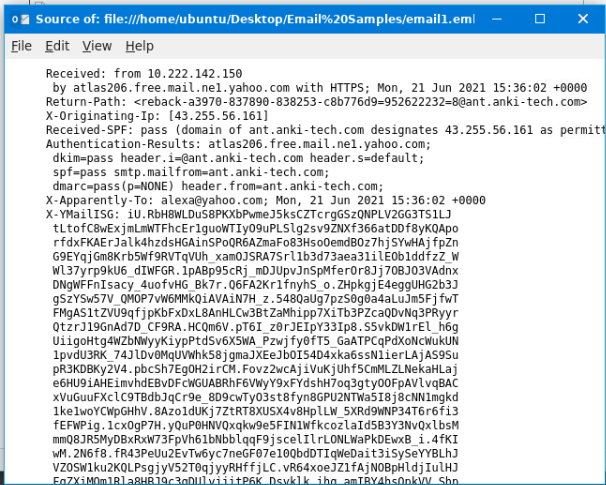
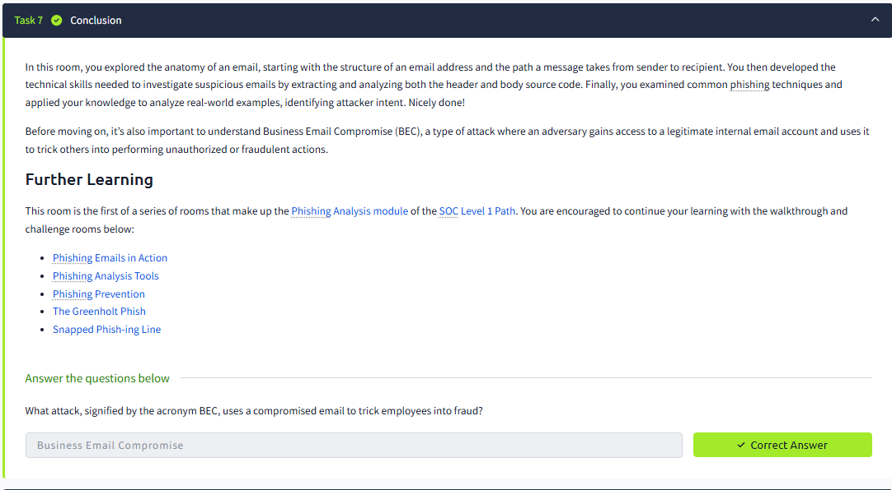

# TryHackMe Writeup: Phishing Analysis Fundamentals

**Platform:** TryHackMe  
**Room:** [Phishing Analysis Fundamentals](https://tryhackme.com/room/phishingemails1tryoe)  
**Difficulty:** Easy  
**Category:** Social Engineering / Phishing Analysis  
**Completed by:** Haziq Danial Bin Nor Azan  
**Date:** June 2026

---

## Overview

This room covers the fundamental components of email structure and how to analyse phishing emails from a defensive security perspective. It explores how emails are composed, delivered, and how attackers abuse the email system through social engineering techniques.

---

## Task 1 – Introduction

This task introduces the concept of phishing as one of the most common entry points for cyber attacks. Understanding the anatomy of an email is critical for identifying suspicious messages before they compromise a system.

---

## Task 2 – The Email Address

### What I Learned

An email address consists of three components:

| Component | Description |
|-----------|-------------|
| **Username** | Identifies the recipient's mailbox on the mail server |
| **@ Symbol** | Separates the username from the domain |
| **Domain Name** | Specifies the mail server responsible for receiving the message |

A helpful analogy: the **domain** is like the street or apartment building, while the **username** is the specific person within that location.

### Question & Answer

**Q: Identify the domain used in the following email address: `hatsalesman@tryhatme.com`**

> **Answer:** `tryhatme.com`

**Explanation:** The email follows the format `username@domain`. The part after the `@` symbol is the domain name.

<p align="center">
  
</p>

---

## Task 3 – Email Delivery

### What I Learned

When an email is sent, several protocols work together to deliver the message:

| Protocol | Full Name | Function |
|----------|-----------|----------|
| **SMTP** | Simple Mail Transfer Protocol | Sends emails from client to mail server |
| **POP3** | Post Office Protocol v3 | Downloads emails to a single device |
| **IMAP** | Internet Message Access Protocol | Syncs emails across multiple devices |

**Key difference between POP3 and IMAP:**
- POP3 downloads email to one device — not accessible elsewhere after download
- IMAP keeps email on the server and syncs across all devices

**Email Journey (6 steps):**
1. Sender's client sends email via **SMTP**
2. Mail server queries **DNS** for recipient's mail server
3. DNS returns the address of the recipient's mail server
4. Email is delivered across the internet to the recipient's server
5. Recipient's email client connects to their mail server
6. Email is retrieved via **POP3** or synced via **IMAP**

### Questions & Answers

**Q1: Which protocol is responsible for sending an email from a client to a mail server?**
> **Answer:** `SMTP`

**Q2: Which service is used to look up the recipient domain's mail server?**
> **Answer:** `DNS`

**Q3: Bob wants to access his email from multiple devices. Which protocol should he use?**
> **Answer:** `IMAP`

<p align="center">
  
</p>

---

## Task 4 – Email Headers

### What I Learned

An email consists of two main parts:
- **Email Header** – Contains metadata such as sender, recipient, and servers involved in delivery
- **Email Body** – Contains the actual message content (plain text or HTML)

Key email header fields:

| Field | Description |
|-------|-------------|
| **From** | Sender's email address |
| **To** | Recipient's email address |
| **Reply-To** | Address where replies are directed |
| **Subject** | Email subject line |
| **Date** | Time and date the email was sent |
| **X-Originating-Ip** | The originating IP address of the sender |

**Viewing raw message source in Thunderbird:** `View → Message Source` or `Ctrl+U`

### Investigation: `email1.eml`

Opening `email1.eml` in Thunderbird revealed the following header details:

```
Subject: Help protect your budget by protecting your home
From: "ADT Security Services" <newsletters@ant.anki-tech.com>
To: alexa@yahoo.com
X-Originating-Ip: [43.255.56.161]
```

### Questions & Answers

**Q1: What is the full subject line of `email1.eml`?**
> **Answer:** `Help protect your budget by protecting your home`

**Q2: What is the IP address listed as the `X-Originating-Ip`?**
> **Answer:** `43.255.56.161`

<p align="center">
  
</p>

---

## Task 5 – Email Body

### What I Learned

The email body contains the actual message, which can be plain text or HTML. Viewing the raw HTML source allows analysts to:
- Inspect embedded links and their true destinations
- Identify malicious attachments
- Detect hidden or obfuscated content

**Attachments in emails** are typically encoded in **Base64** and identified by headers:
- `Content-Type` – Indicates the file type (e.g., `application/pdf`)
- `Content-Disposition` – Specifies the filename
- `Content-Transfer-Encoding` – Shows encoding method (e.g., `base64`)

### Investigation: `email2.txt`

Opening `email2.txt` revealed the following attachment headers:

```
Content-Type: application/pdf; filename="zmqpalgh.pdf"
Content-Disposition: attachment; filename="zmqpalgh.pdf"
Content-Transfer-Encoding: base64
```

The Base64-encoded data was decoded using **CyberChef** (`From Base64` operation), which revealed a hidden flag embedded in the PDF.

### Questions & Answers

**Q1: What is the `Content-Type` of the attachment?**
> **Answer:** `application/pdf`

**Q2: What is the name of the attachment?**
> **Answer:** `zmqpalgh.pdf`

**Q3: What is the hidden flag value? (Base64 decoded)**
> **Answer:** `THM{BENIGN_PDF_ATTACHMENT}`

<p align="center">
  
</p>

<p align="center">
  
</p>

<p align="center">
  
</p>

<p align="center">
  
</p>
---

## Task 6 – Types of Phishing

### What I Learned

Different types of malicious emails:

| Type | Description |
|------|-------------|
| **Spam** | Unsolicited bulk emails sent to many recipients |
| **Phishing** | Impersonates a trusted entity to steal sensitive information |
| **Spear Phishing** | Targeted phishing aimed at a specific individual or organisation |
| **Whaling** | Targets high-level executives (CEO, CFO) |
| **Smishing** | Phishing via SMS/text messages |
| **Vishing** | Phishing via voice calls |

**Common characteristics of phishing emails:**
- Spoofed From Address
- Urgent Subject Line ("Your account will be locked in 24 hours")
- Brand Impersonation
- Grammar & Spelling Issues
- Generic Content ("Dear Customer")
- Hidden or Shortened Links
- Malicious Attachments

**Defanging:** URLs and IP addresses are made unclickable during analysis by replacing `.` with `[.]` and `http` with `hxxp`.

Example:
- Original: `http://www.suspiciousdomain.com`
- Defanged: `hxxp[://]www[.]suspiciousdomain[.]com`

### Investigation: `email3.eml`

Analysing `email3.eml` in Thunderbird revealed a phishing email impersonating **Home Depot**, using a fake domain (`teckbe.com`) to deceive the recipient.

**Raw message source findings:**
```
From: =?UTF-8?B?VGhhbmsgeW91ISBIb21lIERlcG90?= <support@teckbe.com>
X-Originating-Ip: [103.234.236.83]
Authentication-Results: atlas102.free.mail.gq1.yahoo.com;
```

### Questions & Answers

**Q1: Which reputable organisation is being spoofed in this phishing attempt?**
> **Answer:** `Home Depot`

**Q2: What is the sender's email address?**
> **Answer:** `support@teckbe.com`

**Q3: What is the defanged `X-Originating-IP`?**
> **Answer:** `103[.]234[.]236[.]83`

**Q4: Which mail server generated the `Authentication-Results` header?**
> **Answer:** `atlas102.free.mail.gq1.yahoo.com`

<p align="center">
  
</p>

---

## Task 7 – Conclusion

### What I Learned

**Business Email Compromise (BEC)** is a type of attack where an adversary gains access to a legitimate internal email account and uses it to trick others into performing unauthorised or fraudulent actions. Unlike typical phishing, BEC exploits trusted internal accounts making it harder to detect.

### Question & Answer

**Q: What attack, signified by the acronym BEC, uses a compromised email to trick employees into fraud?**
> **Answer:** `Business Email Compromise`

---

## Summary

| Task | Topic | Key Takeaway |
|------|-------|--------------|
| Task 2 | Email Address | Format: `username@domain` |
| Task 3 | Email Delivery | SMTP sends, DNS routes, IMAP syncs |
| Task 4 | Email Headers | X-Originating-Ip reveals true sender IP |
| Task 5 | Email Body | Base64 attachments can hide malicious content |
| Task 6 | Types of Phishing | Defang URLs/IPs when sharing IOCs |
| Task 7 | Conclusion | BEC uses legitimate accounts for fraud |

---

## Tools Used

- **TryHackMe AttackBox** – Virtual machine for analysing email samples
- **Thunderbird** – Email client used to open `.eml` files and view message source
- **CyberChef** – Used to decode Base64-encoded attachment data

---

## Flags Captured

| Flag | Task |
|------|------|
| `THM{BENIGN_PDF_ATTACHMENT}` | Task 5 – Email Body |

<p align="center">
  
</p>

---

*Writeup written as part of Social Engineering exercise — IKB21403 Vulnerability Analysis, UniKL MIIT*
